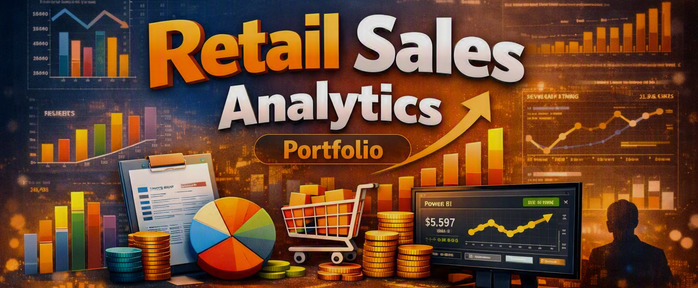
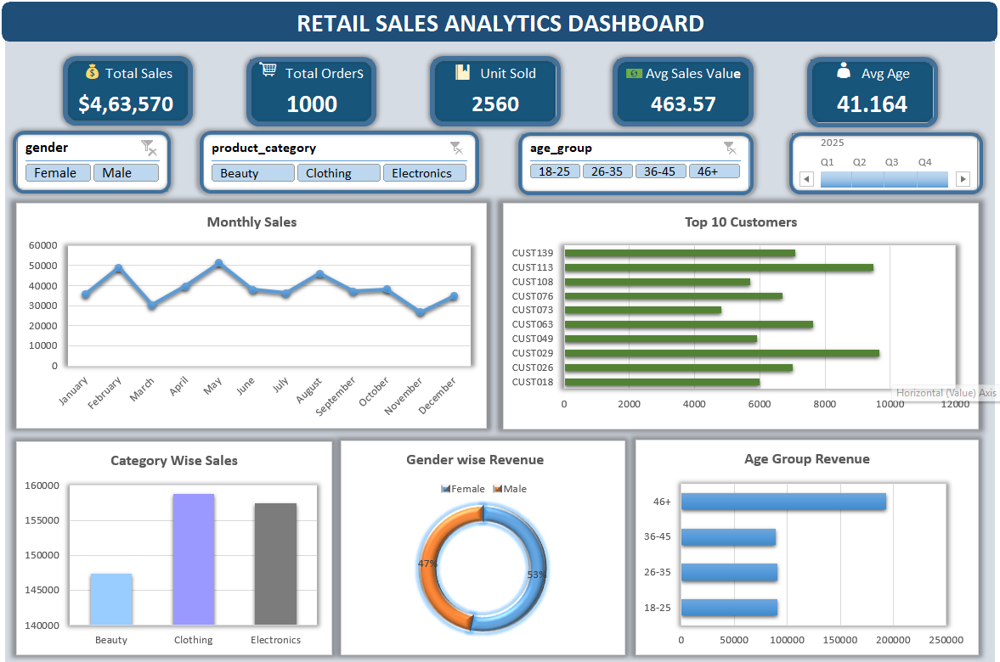
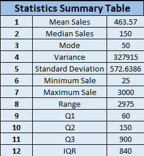
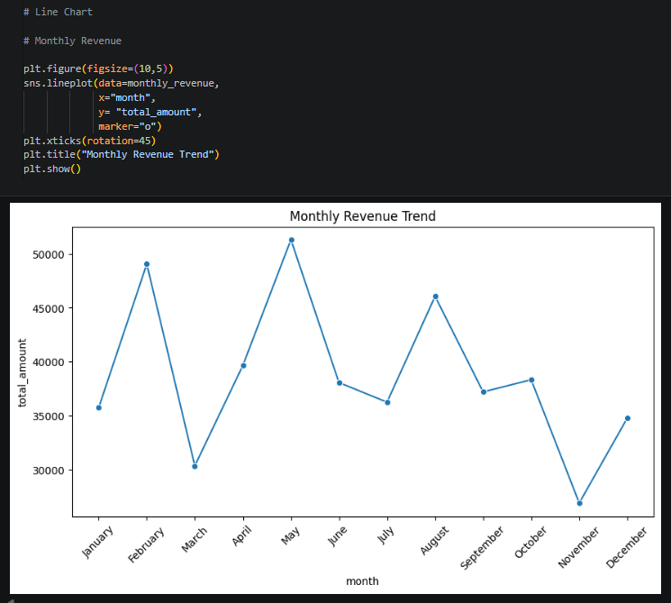
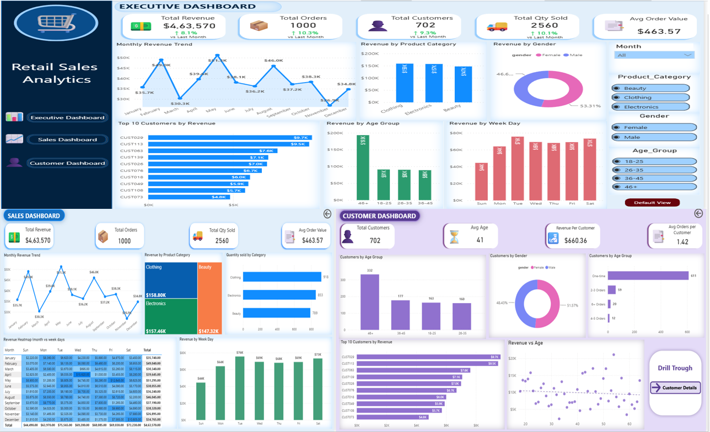
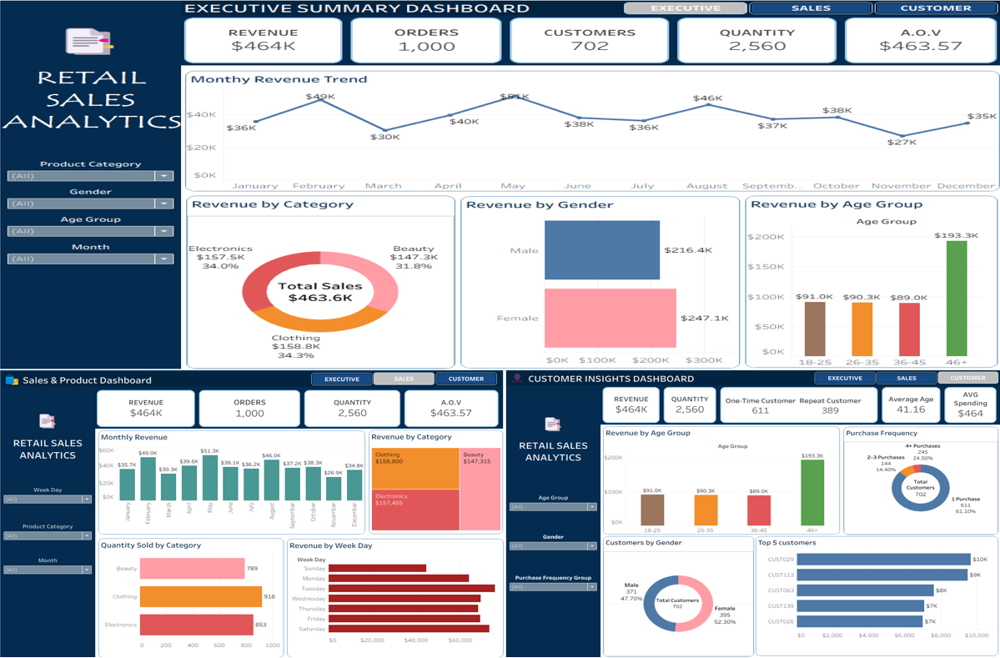
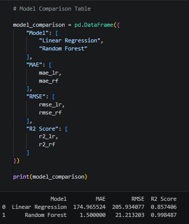
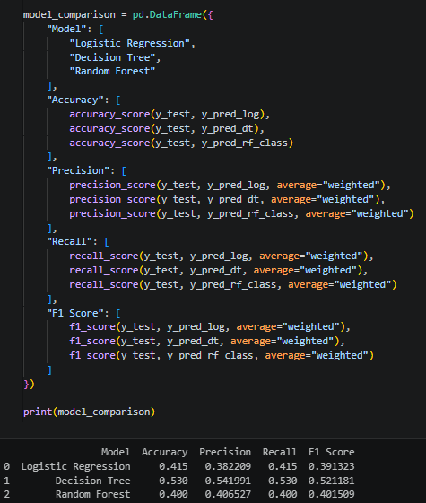
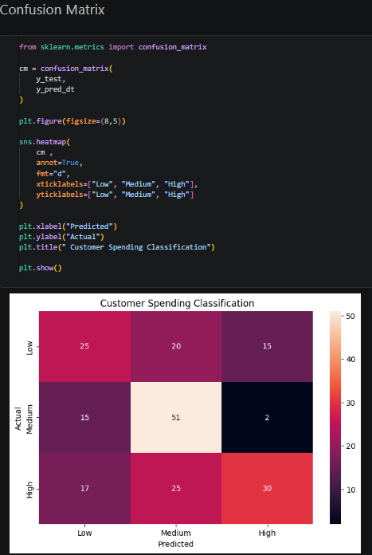

# Retail Sales Analytics Project

## 📌 Project Overview

This is an end-to-end Retail Sales Analytics project using Excel, Statistics, SQL, Python, Power BI, Tableau and Machine Learning, created as part of my Data Analyst portfolio.
The project analyzes retail transaction data to understand sales performance, customer behavior, product performance, and customer spending patterns.

---

## 🎯 Project Objectives

The objectives of this project are:

- Analyze overall retail sales performance
- Identify monthly sales trends
- Analyze product and category performance
- Understand customer purchasing behavior
- Identify repeat customers
- Find top customers
- Build dashboards
- Apply statistical analysis
- Perform exploratory data analysis
- Apply basic machine learning techniques

---

## 🛠️ Tools & Technologies

- **Excel** – Data Cleaning, Pivot Tables, Charts & Dashboard
- **SQL / MySQL** – Data Analysis & Business Queries
- **Python** – Data Cleaning, Feature Engineering & EDA
- **Pandas & NumPy** – Data Manipulation
- **Matplotlib, Seaborn & Plotly** – Data Visualization
- **Power BI** – Business Dashboard
- **Tableau** – Data Visualization
- **Scikit-Learn** – Machine Learning

---

## 📂 Project Structure

**Retail-Sales-Analytics**

- Data
	- retail_sales_raw.csv
 	- retail_sales_cleaned.csv
  	- retail_sales_feature_engineered.csv
- Excel
- Statistics
- SQL
- Python
- PowerBI
- Tableau
- Machine_Learning
- README.md

---

# Excel Analysis

The Excel section focuses on data cleaning, analyzing, visualization, and dashboard creation. 

## Data Cleaning

- Removed duplicate records
- Handled missing values
- Updated numerical and amount columns
- Formatted date column

## Analysis

Created Pivot Tables

- Monthly Sales
- Product-wise Sales
- Gender-wise Revenue
- Age Group Revenue
- Top Customers

## Visualizations

- Line Chart
- Column Chart
- Donut Chart
- Bar Chart
- Slicers

## Dashboard KPIs

- Total Sales
- Total Orders
- Average Order Value
- Average Customer Age
- Best Selling Category

## Excel Dashboard Preview

---

# Statistical Analysis

Statistical analysis was performed to understand the distribution and variation of sales data.

## Descriptive Statistics

- Mean
- Median
- Mode
- Variance
- Standard Deviation
- Range
- Quartiles
- Interquartile Range (IQR)

## Hypothesis Testing
- T-Test

---

# SQL Analysis

My SQL was used to perform business-oriented analysis on the retail sales dataset.

## Queries

- Total Revenue
- Total Orders
- Monthly Revenue 
- Top Customers
- Best Selling Category
- Average Customer Age 

## SQL Concepts Demonstrated

- SELECT
- WHERE
- HAVING
- GROUP BY
- ORDER BY
- CASE
- Aggregate Functions
- Window Functions
- Common Table Expressions (CTE)
- Views

---

# Python & Exploratory Data Analysis

Python was used for data cleaning, feature engineering, exploratory analysis and visualisation.

- **Created Connection with MySQL Database**

## Libraries

- Pandas
- NumPy
- Matplotlib
- Seaborn
- Plotly
- scikit-learn 

## Data Cleaning
    Used:
	df.info()
	df.describe()
	df.isnull().sum()
	df.duplicated().sum()

## Feature Engineering
Created:
- Day
- Week
- Weekday

## Exploratory Data Analysis

- **Sales Analysis**
    - Sales Trend
    - Monthly Revenue

- **Product Analysis**
    - Highest Selling Category
    - Lowest Selling Category

- **Customer Analysis**
    - Gender Distribution
    - Repeat Customers
    - Revenue Analysis
    - Average Basket Size
    - Age Distribution
    - Revenue by Gender
    - Revenue by age group
    - Revenue by month

- **Visualization**
    - Bar Chart
    - Histogram
    - Boxplot
    - Vilon Plot
    - Line Chart
    - Heatmap
    - Pairplot
    - Correlation Matrix

**Python EDA Preview**
 

---

# Power BI Analytics
  An interactive Power BI dashboard was created to analyze sales and customer performance.

- **Dashboards**
    - Executive dashboard
    - Sales Dashboard
    - Customer Dashboard

- **KPIs**
    - Total Revenue
    - Orders
    - Average Order Value
    - Customers
    - Quantity

- **Analysis**
    - Monthly Sales Trend
    - Category Revenue
    - Product Quantity
    - Revenue by Age group Analysis
    - Gender Analysis
    - Purchase Frequency
    - Top Customers

- **Intrective Features**
	- Slicers
    - Filters
    - DAX Measures
    - Drill-through

**Power BI Dashboard**

# Tableau Analytics 

A Tableau dashboard was developed to provide interactive sales and customer insights.

- **Dashboard Components**
    - KPI Cards
    - Sales Trend
    - Product Analysis
    - Customer Analysis
    - Filters
    - Parameters
    - Dashboard Actions

**Tableau Dashboard**

---

# Machine Learning

Two beginner-level Machine Learning projects were developed.

## Project 1 - Sales Prediction

*Objective*

Predict the Total Amount using customer and transaction features.

- **Target variables**
    - Total Amount

- **Features**
    - Age
    - Gender
    - Product Category
    - Quantity
    - Price per unit

- **Models**
    - Linear Regression
    - Random Forest Regressor

- **Evaluation Metrics**
    - MAE
    - RMSE
    - R² Score

  

---

## Project 2 - Customer Spending Prediction

*Objective*

Classify customers into different spending categories.

- **Spending Categories**
  	- Low Spender
  	- Medium Spender
  	- High Spender
  
- **Models**
    - Logistic Regression
    - Decision Tree
    - Random Forest Classifier

- **Evaluation Metrics**
    - Accuracy
    - Precision
    - Recall
    - F1 Score
    - Confusion Matrix

**Model Comparison**

**Confusion Matrix**

---

# **Key Findings**

## Sales Performance

- Total revenue generated was **$463,570** across **1,000 transactions**.
- A total of **2,560 units** were sold.
- Average Order Value was **$463.57**.
- Average customer age was approximately **41 years**.

## Statistical Analysis

- The large difference between the mean **463.57** and median **150**, along with the high standard deviation, indicates that the sales distribution is right-skewed, with some high-value transactions pulling the average upward.
- Transaction values ranged from **$25 to $3,000**.
- The IQR was **840**, showing substantial variation in transaction values.

## Customer & Product Insights

- Customer age did not show a strong relationship with purchase behavior in this dataset.
- Price per unit showed a very strong positive relationship with total transaction value.
- Quantity showed a moderate relationship with total transaction value.
- Customer spending was analyzed by gender, age group, purchase frequency, and category.

## Machine Learning — Sales Prediction

- Random Forest performed significantly better than Linear Regression.
- Random Forest achieved:
  - **MAE: 1.50**
  - **RMSE: 21.21**
  - **R²: 0.9985**
- Linear Regression achieved:
  - **MAE: 174.97**
  - **RMSE: 205.93**
  - **R²: 0.8574**

## Machine Learning — Customer Spending Classification

- Decision Tree performed best among the three classification models.
- Decision Tree achieved:
  - **Accuracy: 53.0%**
  - **Precision: 54.20%**
  - **Recall: 53.0%**
  - **F1 Score: 52.12%**
- The moderate classification performance suggests that the selected features were not sufficient to predict spending categories with high accuracy.

---
# Project Workflow

Retail Sales Data
       
Data Cleaning
       
Excel Analysis
       
Statistical Analysis
       
SQL Analysis
       
Python & EDA
       
Power BI Dashboard
       
Tableau Dashboard
       
Machine Learning
       
Business Insights

---
# Business Questions Answered

This project answers questions such as:

- What is the overall sales performance?
	- The dataset contains 1,000 transactions and generated total sales of $463,570. A total of 2,560 units were sold, with an average order value of $463.57. The average customer age was approximately 41.16 years.

- How does revenue change over time?
	- May was the strongest month with $51295 revenue, while November was the weakest with $26895.

- Which product category performs best?
	- The SQL project also specifically calculates both the highest-revenue category and best-selling category by quantity. 
Clothing is the best-performing category, generating $158,800 revenue and selling 918 units.
An interesting additional finding is that Beauty has the highest average transaction value at approximately $479.85, even though it has the lowest total revenue of the three categories.

- Which customers generate the highest revenue?
	- CUST029 is the highest-value customer, spending $9650.

- Are there differences in spending by gender?
	- Female customers generated more total revenue and had a slightly higher average transaction value.

- Does age influence spending?
	- The Python analysis found that age did not have a meaningful relationship with purchase behavior.

- Who are the repeat customers?
	- 91 customers are repeat customers, with CUST113 having the highest purchase frequency at 16 transactions.

- What is the average basket size?
	- Customer purchase is around 2–3 units per transaction.

- Can customer be classified into spending categories?
	- SQL project created spending categories using a CASE statement

- Can sales be predicted using machine learning?
	- Yes, Random Forest significantly outperformed Linear Regression on the test data.
The Random Forest achieved an R² of 0.9985, meaning it explained approximately 99.85% of the variance in the test-set target according to your evaluation.

- Can customers be classified into spending categories?
	- Customer spending categories can be classified, but the current features do not provide highly accurate predictions. Decision Tree performed best among the three models tested.

--- 

# Key Skills Demonstrated

Through this project, I demonstrated practical knowledge of:
  - Data Cleaning
  - Data Analysis
  - Excel
  - SQL
  - Python
  - Statistics
  - Exploratory Data Analysis
  - Data Visualization
  - Power BI
  - Tableau
  - Machine Learning
  - Business Intelligence

---

# About Me

**Maneesh Singh Samant**

Aspiring Data Analyst

**Skills:**  Excel | SQL | Python | Statistics | Power BI | Tableau | Machine Learning

---

# Thank you for visiting my project!
